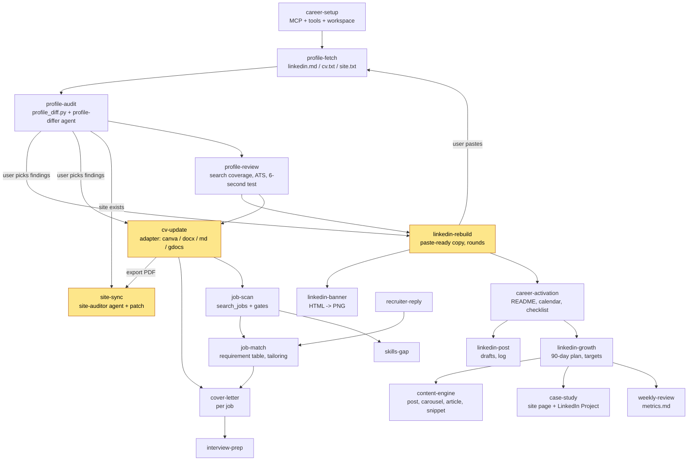

# Flow



Yellow nodes end in a human gate: paste by hand, explicit yes for commit/export, explicit yes for
git commit and push.

## Data flow

```
workspace/
  career.json            config: person, cv adapter, site, target role, rules
  profile/               the "kernel": identity, voice, constraints, positioning, cv-canonical, accepted
  sources/               fetched dumps (gitignored)
  out/                   generated: audit, review, rebuild rounds, banner, cv.pdf, cover letters,
                         activation, growth-plan, content/, case-studies/, metrics, jobs, matches, interviews
```

Facts flow one way: `cv-canonical.md` -> LinkedIn copy, site, cover letters. When LinkedIn is
newer (the person edited it directly), `cv-update` first pulls the change into cv-canonical.

## Why the agents are read-only

Every agent (`profile-differ`, `site-auditor`, `linkedin-auditor`) has Write and Edit disallowed.
Writes happen in skills, in the main conversation, where the person can see and approve them.
LinkedIn has no profile-edit API; the only write paths are paste-by-hand or a browser tool
driven one field at a time (`docs/linkedin-writes.md`).
