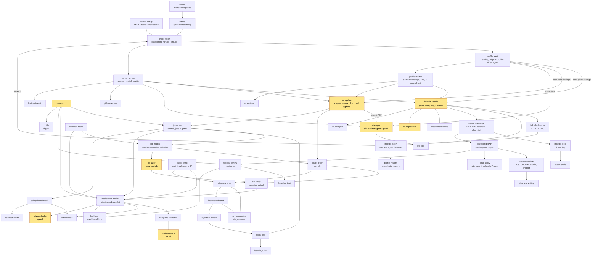

# Flow



Yellow nodes are where the automation mode decides: `draft` stops with a file, `assisted` asks
once, `auto` executes (subject to `approvals` in `career.json`).

## Data flow

```
workspace/
  career.json            config: person, cv adapter, site, target role, rules
  profile/               the "kernel": identity, voice, constraints, positioning, cv-canonical, accepted
  sources/               fetched dumps (gitignored)
  out/                   generated: audit, review, rebuild rounds, banner, cv.pdf, cover letters,
                         activation, growth-plan, content/, case-studies/, metrics, jobs, matches, interviews
```

Facts flow one way: `cv-canonical.md` -> LinkedIn copy, site, cover letters. When LinkedIn is
newer (the person edited it directly), `cv-update` first pulls the change into cv-canonical.

## Agents

Analysis agents (`profile-differ`, `site-auditor`, `linkedin-auditor`) have Write and Edit
disallowed. `linkedin-operator` is the single write path to LinkedIn for things that have no
API (profile fields, posts, banner, analytics, Easy Apply); it follows the protocol in
`docs/automation.md`. Messages and connection requests go through the LinkedIn MCP server.
